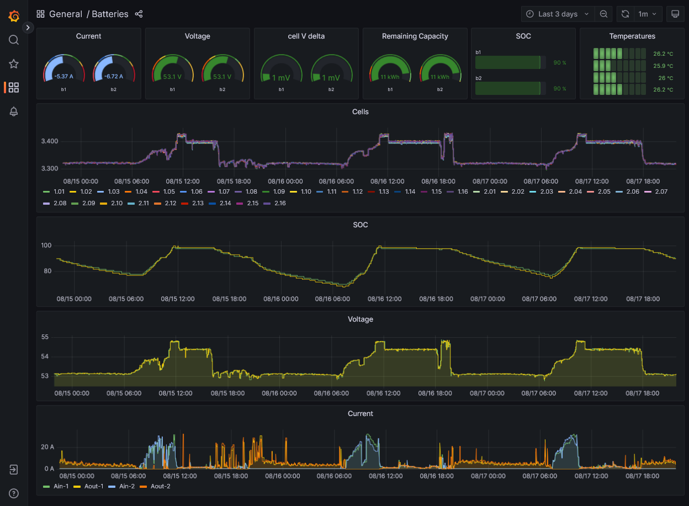

# jkbms-influxdb-grafana
Howto visualize JK BMS values in grafana

The following has been working perfectly now for months:
  1. jkbms from https://github.com/jblance/mpp-solar
     - configured to read from bluetooth
     - writing output to MQTT
  1. Optional, if jkbms is not started as a daemon
     - crontab to read two separate JK BMS using a script:
     
     `*/2    *  *  *  *   /root/bin/read_jkbms.sh 2>&1 >> /var/log/read_jkbms.log`

     see [read_jkbms.sh](read_jkbms.sh) (insert your JKBMS BT MAC addresses)
  1. [telegraf](https://www.influxdata.com/time-series-platform/telegraf/) with a [confguration](telegraf_read_mqtt_jkbms.conf) for
     - reading MQTT
     - selecting the relevant keys
     - translating the long JKBMS names into short ones for the DB
     - writing the values to influxdb v2
  1. [influxdb](https://www.influxdata.com/get-influxdb/) (currently I'm using version 2.10)
     - with a bucket and access token configured
  1. [grafana](https://grafana.com/grafana/) (currently I'm using version 9.4.7) with
     - a data source configured to access the influxdb bucket
     - [dashboard](grafana_jkbms_battery.json) to display the battery values

The three example configuration files are linked in this git repository for re-use.

Screenshot:

